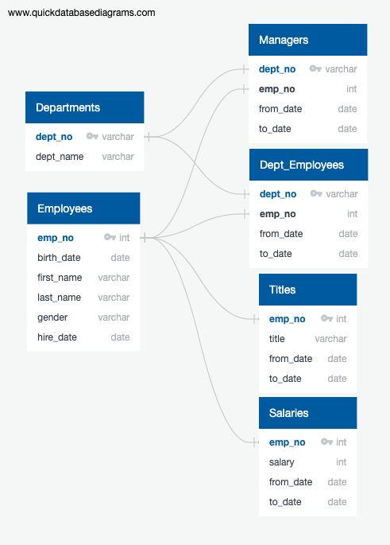

# Pewlett-Hackard Human Resources Analysis
module 7 challenge
## Goal
The goal of this project was to query various employee information databases to find some information on the employees at PH who are eligible for retirement and generate a list of potential mentors who are eligible for younger or new employees.
## Findings
We found that currently, there are 33,118 employees who are eligible for retirement out of 240,120 total current employees. Out of these we identified 1549 current employees born around 1965 who could potentially be mentors for younger employees. Further analysis could be done by breaking down the current employees into age groups to see what percentages of the workforce they comprise. It would also be interesting to find the average length of time that an employee stays at PH to determine average turnover. 
## Database Visualisation
To query this I created the following data base diagram using quickDBD.

##Query Codes
## Code
### List of Retirees with Title and Salary
```SQL
SELECT ce.emp_no, ce.first_name, ce.last_name, t.title, t.from_date, s.salary
INTO retirees_titles
FROM salaries AS s
RIGHT JOIN titles as t
ON (s.emp_no = t.emp_no)
RIGHT JOIN current_emp AS ce
ON (ce.emp_no = s.emp_no)
ORDER BY emp_no;
```
#### Output

### Unique List of Retirees with Title and Salary
```SQL
SELECT emp_no, first_name, last_name, title, from_date, salary
INTO retirees_titles_unique
FROM (SELECT emp_no, first_name, last_name, title,
	from_date, salary, ROW_NUMBER() OVER (PARTITION BY (emp_no) ORDER BY from_date DESC) rn
	 FROM retirees_titles) AS rt
	 WHERE rn = 1;
```
#### Output

### List of mentors from 1965
```SQL
SELECT e.emp_no, e.first_name, e.last_name, t.title, de.from_date, de.to_date
INTO mentors_list
FROM employees as e
RIGHT JOIN titles as t
ON (e.emp_no = t.emp_no)
RIGHT JOIN dept_emp AS de
ON (e.emp_no = de.emp_no)
WHERE (e.birth_date BETWEEN '1965-01-01' AND '1965-12-31')
AND (de.to_date = '9999-01-01')
ORDER BY emp_no;
```
#### Output

### List of unique mentors from 1965
```SQL
SELECT emp_no, first_name, last_name, title, from_date, to_date
INTO mentors_list_unique
FROM (SELECT emp_no, first_name, last_name, title,
	from_date, to_date, ROW_NUMBER() OVER (PARTITION BY (emp_no) ORDER BY from_date DESC) AS rn
	 FROM mentors_list) AS ml
	 WHERE rn = 1;
```
#### Output
